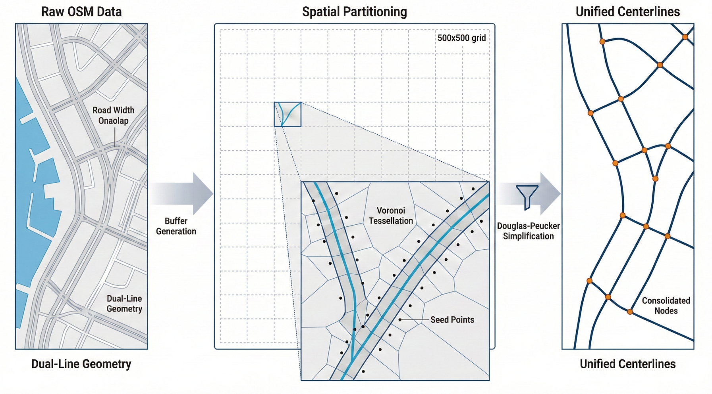

# 🌍 A Global Dataset of Urban Road Centrelines for Coastal Cities

[](LICENSE)
[](https://doi.org/10.6084/m9.figshare.31696105)
[](.)
[](.)

> **Unified road centrelines for spatial analysis** — converting traffic‑oriented,
> multi‑lane road networks into a single coherent centreline per corridor using Voronoi
> tessellation with adaptive spatial partitioning.



This repository contains the **centreline‑extraction tool** that produced the dataset, so
you can run it on your own road networks. The dataset itself is on figshare
([Download](#-download)).

---

## 📖 Overview

Coastal cities, home to **over 40 % of the global population**, need accurate spatial data
for urban planning and climate adaptation. But mainstream road datasets are
**traffic‑oriented**: a multi‑lane road is stored as several parallel lane geometries.

**The problem.** When a four‑lane road is four separate lines, spatial analyses such as
space syntax and centrality count it four times, **distorting urban spatial structure**.

**Our solution.** A fast Voronoi‑tessellation engine that collapses each road corridor
into a single centreline between intersections — applied here to **2,073 coastal cities
across 110 countries**.

---

## 🌐 Geographic coverage

| Continent | Cities |
|-----------|-------:|
| 🌏 Asia | 908 |
| 🌎 North America *(incl. Central America & Caribbean)* | 314 |
| 🌍 Europe | 307 |
| 🌍 Africa | 248 |
| 🌎 South America | 208 |
| 🌏 Oceania | 88 |
| **Total** | **2,073** |

---

## 📥 Download

The full dataset (raw + centreline GeoParquet for all 2,073 cities) is on **figshare**:

### 🔗 [https://doi.org/10.6084/m9.figshare.31696105](https://doi.org/10.6084/m9.figshare.31696105)

```
raw_road_networks/         {Country}_{City}_roads.parquet        # source roads (Overture)
centerline_road_networks/  {Country}_{City}_centerline.parquet   # extracted centrelines
```

All geometries are **WGS84 (EPSG:4326)** LineStrings.

| File | Key attributes |
|------|----------------|
| `*_roads.parquet` (raw) | `id` (source id, traceability), `subtype` (road/rail), `class` (motorway…residential), `geometry` |
| `*_centerline.parquet` | `geometry` only — minimal schema; derive length/orientation/connectivity with standard GIS ops, or spatial‑join back to the raw `class`/`id` |

---

## 🛠️ Use the extractor on your own roads

The engine is **C# / .NET 8**; a small Python driver handles batch processing and
CRS reprojection.

**Requirements:** the [.NET 8 SDK](https://dotnet.microsoft.com/download) and Python 3.10+
with `pip install -r requirements.txt`.

### Build the engine

```bash
dotnet build extractCentroidLine_csharp/extractLine/extractLine.slnx -c Release
```

### Option A — batch driver (recommended)

`execute/main.py` reads `*_roads.parquet` (EPSG:4326), reprojects each city to UTM, runs
the engine, reprojects back to WGS84, and writes `*_centerline.parquet`. It builds the C#
project once at startup, runs cities in parallel as isolated subprocesses (a city that
runs out of memory is logged and skipped — the batch keeps going), and is resumable
(completed cities are checkpointed in `processed_cities.txt`).

```bash
python execute/main.py \
    --input_dir  data/raw_road_networks \
    --output_dir data/centerline_road_networks \
    --workers 10 --big_workers 2 --big_mb 18
```

Per‑city parameters and timings are written to `parameters.csv`. For very large cities,
lower `--workers` / `--big_workers` (memory scales with network size).

### Option B — standalone CLI (one network)

```bash
# input must already be in a metric CRS (e.g. UTM); prints the chosen params + RESULT:features=N
extractCentroidLine_csharp/extractLine/extractLine/bin/Release/net8.0/extractLine.exe \
    input.geojson output.geojson \
    --buffer 2 --adaptive --minbuf 1 --maxbuf 25 --seed 5 --epsilon 8 --segment 2
```

### Parameters

The release uses the **"D recipe"** (the default in `execute/main.py`) — a tight
grid‑adaptive buffer tuned for maximum detail:

```
--buffer 2 --adaptive --minbuf 1 --maxbuf 25 --seed 5 --epsilon 8 --segment 2
```

`--seed` is the seed‑point spacing in metres and is the main lever on both detail and
memory (smaller = finer but heavier). Pass `--auto` to `main.py` to instead derive
parameters from road density. All lengths are in metres, so extraction runs in a
projected CRS (the driver handles WGS84 ⇄ UTM automatically).

---

## ⚡ Performance

On a single workstation (Intel Core i9‑14900K @ 3.20 GHz, 96 GB RAM), measured over the
complete production run of all 2,073 urban areas, **processing time follows a power law in
network size with a fitted exponent of 0.91**. The **median urban area is processed in
74 s**, and a **~7,000‑segment network in ~34 s** (63 % of urban areas under 2 minutes,
84 % under 5 minutes).

---

## 🔬 How it works

The engine identifies the geometric centre of each road corridor via Voronoi tessellation
(`MetaCity.DataProcessing.CenterLineExtraction.Extract`):

1. Preprocess (reduce precision, extract LineStrings).
2. **Grid partitioning** — split the bbox into cells; buffer roads per cell; union adjacent buffers.
3. Interpolate seed points along buffer boundaries (spacing = `--seed`).
4. **Voronoi** via Delaunay triangulation over the seed points.
5. Keep Voronoi ridges that fall inside the buffer polygons.
6. Connect ridge segments into LineStrings between intersection vertices.
7. Douglas–Peucker simplification (`--epsilon`).
8. Remove dangles, delete short segments and collapse their components to centroids.
9. Final dangle removal + reconnect.

Built with [NetTopologySuite](https://github.com/NetTopologySuite/NetTopologySuite)
(buffer/overlay/simplify) and [DelaunatorSharp](https://github.com/nol1fe/delaunator-sharp)
(Delaunay → Voronoi).

---

## 💻 Quick start (use the data)

```python
import geopandas as gpd

roads = gpd.read_parquet("centerline_road_networks/Portugal_Lisbon_centerline.parquet")
roads["length_m"] = roads.to_crs(roads.estimate_utm_crs()).length
print(f"{len(roads)} segments, {roads['length_m'].sum()/1000:.1f} km")
roads.plot(figsize=(10, 10), linewidth=0.5)
```

In **QGIS**, drag the `.parquet` straight onto the canvas. For network analysis, use
`momepy.gdf_to_nx(roads)` and compute centralities, etc.

---

## 📚 Applications

Space syntax & urban morphology · climate‑adaptation / sea‑level‑rise vulnerability ·
GeoAI / graph neural networks · transportation network analysis — all without
lane‑duplication artefacts.

---

## 📄 License

- **Code** (this repository): [MIT](LICENSE)
- **Dataset** (figshare release): CC BY 4.0 — see the [figshare record](https://doi.org/10.6084/m9.figshare.31696105)

---

## 🙏 Acknowledgments

- **Overture Maps Foundation** — source road network data
- **European Commission JRC** — GHS Urban Centre Database (GHS‑UCDB R2024A), used for city selection
- **Natural Earth** — 1:10m coastline data
- **NetTopologySuite** & **DelaunatorSharp** — geometry and Delaunay/Voronoi libraries
